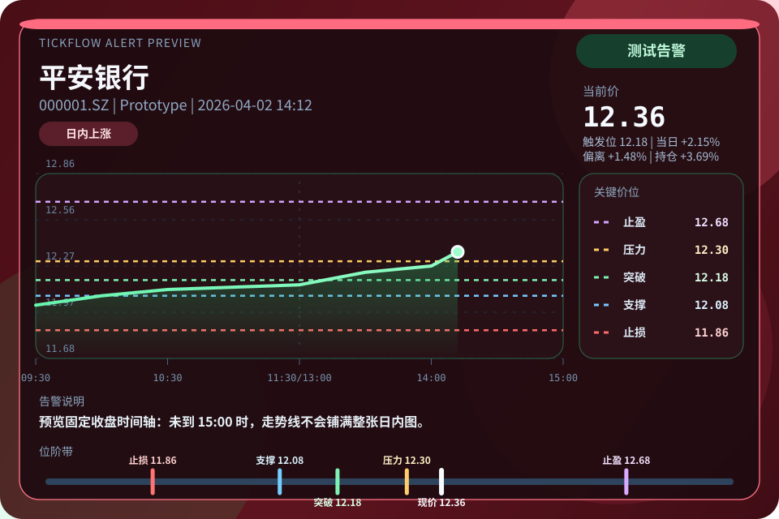

# 📈 TickFlow Assist

基于 [OpenClaw](https://openclaw.ai) 的 A 股监控与分析插件。它使用 [TickFlow API](https://tickflow.org/auth/register?ref=BUJ54JEDGE) 获取行情与财务数据，并可选接入 [金十数据 MCP](https://mcp.jin10.com/app/) 快讯流，结合 LLM 生成技术面、基本面、资讯面的综合判断，并把结果持久化到本地 LanceDB。

最近更新：`v0.3.4` 新增 `09:20` 盘前资讯简报，修复 Jin10 历史补页重复推送与状态页最新快讯显示错误，并降低 Telegram 图文告警被误判失败后重复补发的风险。完整发布记录见 [CHANGELOG.md](CHANGELOG.md)。

当前主线架构：

- OpenClaw 插件是主入口
- JS/TS 负责主业务流程
- Python 仅保留技术指标计算

兼容性要求：

- TickFlow Assist 当前主线按 OpenClaw `v2026.3.31+` 对齐，已验证社区安装在 `v2026.4.11` 上兼容
- 建议 Node `>=22.14.0`，并以目标 OpenClaw 版本上游要求为准

## 🧭 项目简介

TickFlow Assist 面向一条完整的“自选管理 -> 数据抓取 -> 综合分析 -> 后台监控 -> 结果留痕”链路，适合在 OpenClaw 中做 A 股日常盯盘、收盘后复盘和分析结果沉淀。

## ✨ 核心特性

- 数据抓取：支持日 K、分钟 K、实时行情、财务数据与金十数据快讯接入，收盘后可批量更新。
- 多维分析：技术面、财务面、资讯面按固定流水线执行，输出综合结论与关键价位。
- 监控告警：围绕止损、突破、支撑、压力、止盈、涨跌幅和成交量异动进行交易时段轮询，并支持金十数据 24 小时快讯候选筛选与事件告警。
- 复盘留痕：收盘后自动生成活动关键价位快照，并提供 `1/3/5` 日回测统计（测试）。
- 本地数据库：使用 LanceDB 保存自选、K 线、指标、分析结果、关键价位和告警日志。

## 📚 文档导航

- 安装指南：[docs/installation.md](docs/installation.md)
- 使用指南：[docs/usage.md](docs/usage.md)
- 更新日志：[CHANGELOG.md](CHANGELOG.md)
- 插件清单：[openclaw.plugin.json](openclaw.plugin.json)
- npm 包：https://www.npmjs.com/package/tickflow-assist
- 内置技能：
  - [skills/stock-analysis/SKILL.md](skills/stock-analysis/SKILL.md)
  - [skills/usage-help/SKILL.md](skills/usage-help/SKILL.md)
  - [skills/database-query/SKILL.md](skills/database-query/SKILL.md)

## 🛠 安装与配置

如果你是从 GitHub 仓库开始安装，优先建议使用一键安装脚本；社区安装更适合只安装正式发布包、不改源码的场景。

### 一键安装脚本（首选）

如果你已经安装了 `git`、`node`、`npm`、`uv`、`openclaw` 与 `jq`，并且想要从源码运行，可以直接运行安装向导：

```bash
bash -c "$(curl -fsSL https://raw.githubusercontent.com/robinspt/tickflow-assist/main/setup-tickflow.sh)"
```

向导会自动完成源码更新、依赖安装、配置写入、插件安装与 Gateway 重启。完整流程见 [docs/installation.md](docs/installation.md)。
在 Linux 上，向导也会 best-effort 安装 PNG 告警卡所需的中文字体。

如果你已经装过旧版本，优先直接执行“升级”。具体升级与重装边界见 [docs/installation.md](docs/installation.md)。

### 社区安装（适合正式发布包）

如果你不需改动源码，可直接通过 OpenClaw 插件市场或 npm 安装：

安装前建议先准备好以下配置：

- 核心必需：`tickflowApiKey`、`llmApiKey`、`llmBaseUrl`、`llmModel`
- 告警投递：`alertChannel`、`alertTarget`、`alertAccount`
- 可选增强：`mxSearchApiKey`、`jin10ApiToken`

其中，`configure-openclaw` 会把这些配置写入 `~/.openclaw/openclaw.json` 的 `plugins.entries["tickflow-assist"].config`；插件启用后会在本地 `databasePath` 下持久化 LanceDB 数据，并运行监控 / 日更等后台服务。
如果你不想把密钥写进配置文件，运行时也支持环境变量回退，优先级是 `openclaw.json / local.config.json` > 环境变量 > 默认值。
常用环境变量：`TICKFLOW_ASSIST_TICKFLOW_API_KEY` / `TICKFLOW_API_KEY`、`TICKFLOW_ASSIST_LLM_API_KEY` / `LLM_API_KEY`、`TICKFLOW_ASSIST_LLM_BASE_URL` / `LLM_BASE_URL`、`TICKFLOW_ASSIST_LLM_MODEL` / `LLM_MODEL`、`TICKFLOW_ASSIST_MX_SEARCH_API_KEY` / `MX_SEARCH_API_KEY` / `MX_APIKEY`、`TICKFLOW_ASSIST_JIN10_API_TOKEN` / `JIN10_API_TOKEN`。

```bash
openclaw plugins install tickflow-assist
npx -y tickflow-assist configure-openclaw
cd ~/.openclaw/extensions/tickflow-assist/python && uv sync
openclaw plugins enable tickflow-assist
openclaw config validate
openclaw gateway restart
```

社区安装时允许先完成插件安装，再通过第二条命令写入 `tickflowApiKey`、`llmApiKey`、`llmBaseUrl`、`llmModel` 等正式配置。
`configure-openclaw` 现在只负责写配置和打印下一步命令，不再自动执行 `openclaw`、`uv` 或系统包安装命令，也不会重新执行插件安装；如果你已经设置了环境变量，密钥项可留空，输入 `-` 可主动清空已有配置并切回环境变量。
如果检测到 `plugins.installs["tickflow-assist"]` 来自 `clawhub`，向导还会把被旧版本钉死的 `spec` 归一化为 `clawhub:tickflow-assist`，避免后续升级一直锁在旧版本。
运行时支持的环境变量回退如下：

- `tickflowApiUrl`：`TICKFLOW_ASSIST_TICKFLOW_API_URL` / `TICKFLOW_API_URL`
- `tickflowApiKey`：`TICKFLOW_ASSIST_TICKFLOW_API_KEY` / `TICKFLOW_API_KEY`
- `tickflowApiKeyLevel`：`TICKFLOW_ASSIST_TICKFLOW_API_KEY_LEVEL` / `TICKFLOW_API_KEY_LEVEL`
- `llmBaseUrl`：`TICKFLOW_ASSIST_LLM_BASE_URL` / `LLM_BASE_URL`
- `llmApiKey`：`TICKFLOW_ASSIST_LLM_API_KEY` / `LLM_API_KEY`
- `llmModel`：`TICKFLOW_ASSIST_LLM_MODEL` / `LLM_MODEL`
- `mxSearchApiUrl`：`TICKFLOW_ASSIST_MX_SEARCH_API_URL` / `MX_SEARCH_API_URL`
- `mxSearchApiKey`：`TICKFLOW_ASSIST_MX_SEARCH_API_KEY` / `MX_SEARCH_API_KEY` / `MX_APIKEY`
- `jin10McpUrl`：`TICKFLOW_ASSIST_JIN10_MCP_URL` / `JIN10_MCP_URL`
- `jin10ApiToken`：`TICKFLOW_ASSIST_JIN10_API_TOKEN` / `JIN10_API_TOKEN`

如果你在 Linux 或 macOS 上需要 PNG 告警卡正常显示中文，请额外手动安装 `fontconfig` 与 Noto CJK 一类中文字体，例如：

```bash
# Debian / Ubuntu
sudo apt-get update
sudo apt-get install -y fontconfig fonts-noto-cjk
fc-cache -fv

# RHEL / Fedora / Rocky / AlmaLinux
sudo dnf install -y fontconfig google-noto-sans-cjk-ttc-fonts
fc-cache -fv

# Arch / Manjaro
sudo pacman -Sy --noconfirm fontconfig noto-fonts-cjk
fc-cache -fv

# Alpine
sudo apk add fontconfig font-noto-cjk
fc-cache -fv

# macOS (Homebrew)
brew install fontconfig
brew install --cask font-noto-sans-cjk
fc-cache -fv
```

### 手动源码安装

```bash
git clone https://github.com/robinspt/tickflow-assist.git
cd tickflow-assist
npm install
cd python
uv sync
cd ..
npm run check
npm run build
openclaw plugins install -l /path/to/tickflow-assist
openclaw plugins enable tickflow-assist
openclaw gateway restart
```


## 🔄 升级

如果你是通过 `openclaw plugins install tickflow-assist` 安装的社区版本，后续升级可直接执行：

```bash
openclaw plugins update tickflow-assist
openclaw gateway restart
```

如果想同时升级所有已跟踪插件，也可以执行：

```bash
openclaw plugins update --all
openclaw gateway restart
```

如果你是通过 `openclaw plugins install -l /path/to/tickflow-assist` 链接本地源码目录，`openclaw plugins update` 不会替你拉源码。此时应在源码目录手动更新后重新构建并重启 Gateway：

```bash
git pull
npm install
cd python
uv sync
cd ..
npm run check
npm run build
openclaw gateway restart
```

## 🚀 使用方式

常见入口有三种：

- OpenClaw 对话：直接说“添加 002261”“分析 002261”“开始监控”。
- Slash Command：使用 `/ta_addstock`、`/ta_analyze`、`/ta_monitorstatus`、`/ta_flashstatus` 等免 AI 直达命令。
- 本地 CLI：通过 `npm run tool -- ...`、`npm run monitor-loop`、`npm run daily-update-loop` 做调试或直连运行。

常用示例：

```text
添加 002261
分析 002261
/ta_addstock 002261 34.15
/ta_monitorstatus
/ta_flashstatus
npm run tool -- analyze '{"symbol":"002261"}'
```

更完整的指令分类、CLI 示例与运行规则见 [docs/usage.md](docs/usage.md)。

## 🧩 架构与目录

后台任务统一由 `tickflow-assist.managed-loop` 托管，在同一个 service 内并行运行日更、实时监控与金十数据 24 小时快讯监控。

```text
tickflow-assist/
├── docs/                         # 安装、使用与示例文档
├── src/                          # 主业务代码
├── src/tools/                    # OpenClaw tools
├── src/services/                 # 行情、分析、金十数据 MCP、监控、告警、更新服务
├── src/background/               # 日更、价格监控与金十数据快讯后台逻辑
├── src/prompts/analysis/         # 分析 prompt
├── skills/                       # 插件内置 skills
├── python/                       # Python 指标计算子模块
├── openclaw.plugin.json          # 插件清单
├── CHANGELOG.md                  # 独立更新日志
└── README.md                     # 项目概览
```

## 🔌 依赖与可选能力

- [TickFlow](https://tickflow.org/auth/register?ref=BUJ54JEDGE)：提供日线、分钟线、实时行情与财务数据接口。
- OpenClaw：负责插件运行、工具注册、对话入口与消息投递。
- [金十数据 MCP](https://mcp.jin10.com/app/)：可选，用于 24 小时快讯流接入、自选关联筛选与事件驱动告警。
- [东方财富妙想 Skills](https://marketing.dfcfs.com/views/finskillshub/)：可选，用于 `mx_search` 与 `mx_select_stock`，也用于非 Expert 财务链路的 lite 补充。

## ⚠️ 风险提示

本项目仅用于策略研究、流程验证与教学交流，不构成任何形式的投资建议、收益承诺或具体交易指引。

- 市场环境、流动性、执行价格与个人交易纪律都会影响实际结果，历史表现不代表未来收益。
- AI 模型、自动化分析与回测结果都可能存在偏差、遗漏或失效，不应作为单一决策依据。
- 使用前请结合自身资金情况、风险承受能力与独立判断审慎评估，并自行承担相应风险。

## 🖼 效果预览

`/ta_testalert` 与 `test_alert` 现在会同时验证文本和 PNG 告警卡链路。下图为当前测试告警样式示例：



## 📝 更新记录

完整历史发布记录见 [CHANGELOG.md](CHANGELOG.md)。

## 🙏 鸣谢

- [TickFlow](https://tickflow.org/auth/register?ref=BUJ54JEDGE) 提供行情数据服务与 API 支持
- [OpenClaw](https://openclaw.ai) 提供插件运行、对话通道与工具编排能力
- [CortexReach/memory-lancedb-pro](https://github.com/CortexReach/memory-lancedb-pro) 给你的 OpenClaw Agent 提供持久化、智能化的长期记忆

## 📄 License

MIT
